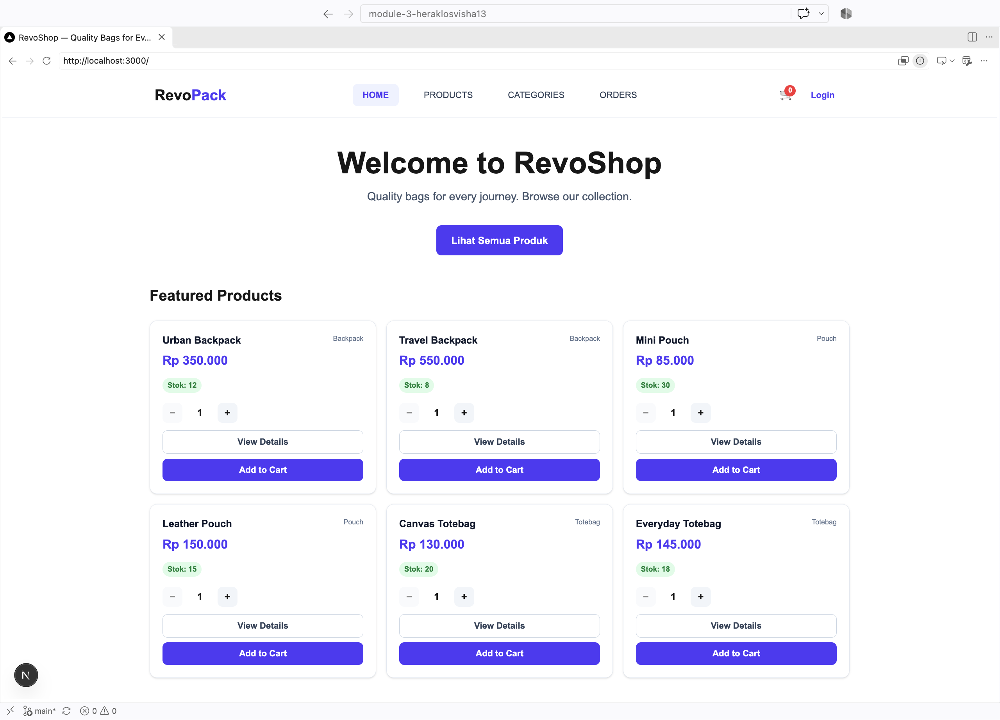
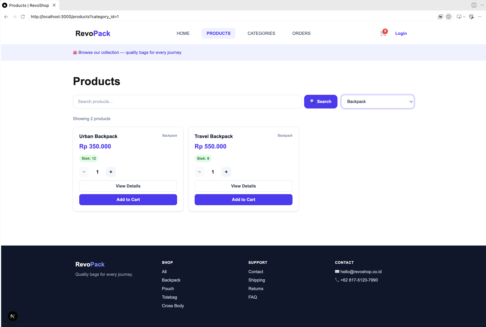
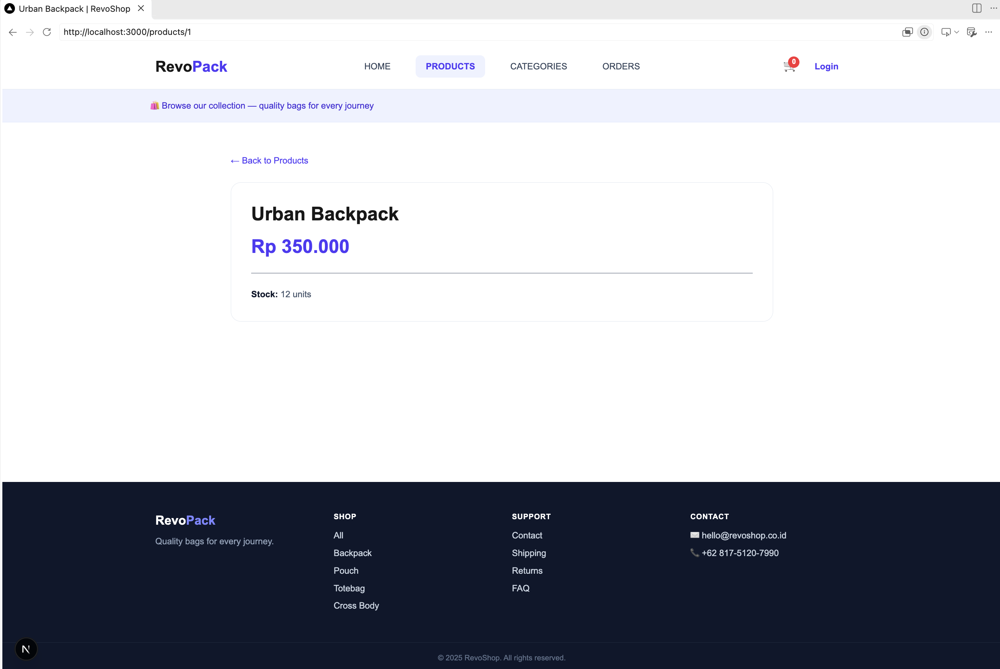
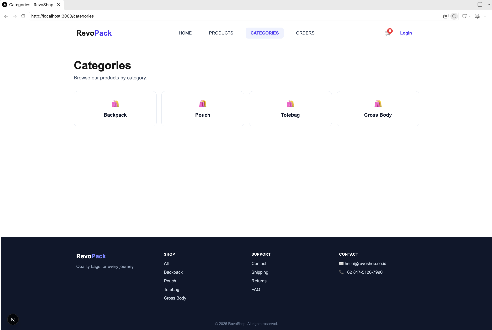
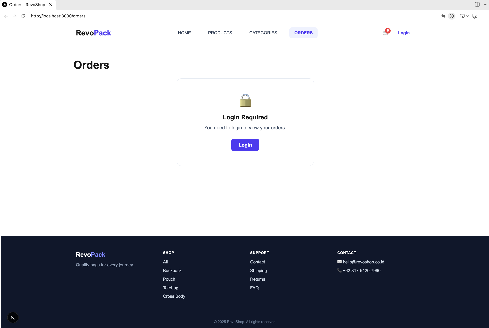
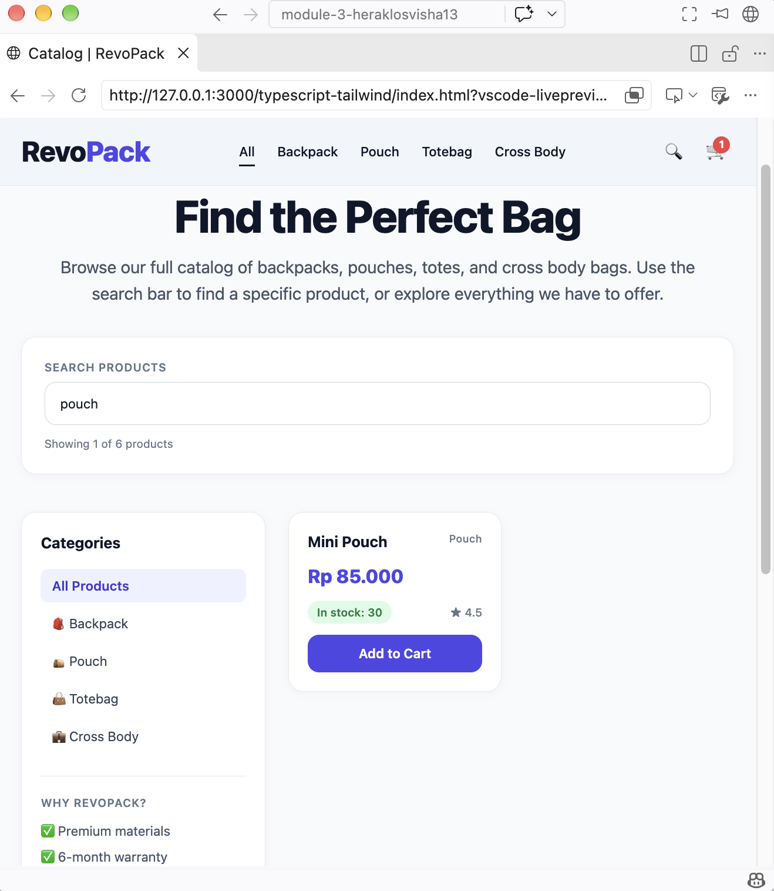
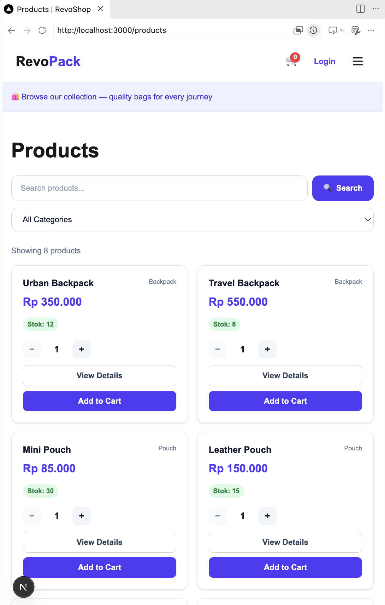

# Module 3 Frontend — RevoShop

## Project Overview

This repository collects the frontend work for the RevoU Full Stack Software
Engineering course, Module 3. It is organized into two parts:

- **`checkpoint-1/typescript-tailwind/`** — an early product catalog built with
  plain TypeScript and Tailwind CSS, bundled as a static page.
- **`revopack-project-next/`** — the main project: a RevoShop storefront built
  with Next.js (App Router), React, TypeScript, and Tailwind CSS. It fetches
  live data from a REST API for products, categories, and orders.

Both share the RevoPack / RevoShop bag-store theme: backpacks, pouches, totes,
and crossbody bags.

## Folder Structure

```text
.
├── README.md
├── .gitignore
├── checkpoint-1/
│   └── typescript-tailwind/        # Static TypeScript + Tailwind catalog
│       ├── dist/                   # Build output (generated)
│       └── node_modules/           # Dependencies (generated)
├── revopack-project-next/          # Main Next.js storefront
│   ├── app/
│   │   ├── layout.tsx              # Root layout (Header + Footer)
│   │   ├── page.tsx                # Home / featured products
│   │   ├── globals.css
│   │   ├── components/             # Header, Footer, Card, ProductCard,
│   │   │                           #   SearchBar, AddProductForm
│   │   ├── products/               # Product list, filter, detail route
│   │   │   └── [id]/               # Dynamic product detail page
│   │   ├── categories/             # Category grid
│   │   └── orders/                 # Order history
│   ├── lib/
│   │   ├── api.ts                  # Typed fetch helpers for the REST API
│   │   └── types.ts               # Shared domain types
│   └── .env.local                 # NEXT_PUBLIC_API_BASE_URL
└── screenshots/
```

The `dist/` and `node_modules/` folders are generated and excluded from version
control.

## Main Project — RevoShop (Next.js)

A server-rendered storefront that reads products, categories, and orders from a
hosted REST API.

### Tech Stack

- Next.js 16 (App Router) with React 19
- TypeScript
- Tailwind CSS v4

### Features

- **Home page** with a hero section and a grid of featured products.
- **Products page** with full-text search and a category filter, both driven by
  URL query params so results are shareable and bookmarkable. Shows a result
  count and an empty state when nothing matches.
- **Product detail pages** on a dynamic `/products/[id]` route, with per-product
  metadata and a `not found` fallback for invalid IDs.
- **Categories page** that links each category back to a filtered product list.
- **Orders page** that lists order history, with a dedicated "login required"
  state when the API returns `401`.
- **Responsive header** with active-link highlighting and a mobile menu that
  closes after a selection.
- **Reusable product card** with stock status, a quantity stepper, disabled
  add-to-cart for out-of-stock items, and a link to the detail page.
- **Add product form** with client-side validation for name, price, stock, and
  category.
- Per-route `loading.tsx` and `error.tsx` for loading and error states.
- Prices formatted as Indonesian Rupiah with `Intl.NumberFormat`.

### Getting Started

The app expects an API base URL. Create `revopack-project-next/.env.local`:

```sh
NEXT_PUBLIC_API_BASE_URL=https://your-api-host.example.com
```

Then, from the project directory, install dependencies and start the dev
server:

```sh
cd revopack-project-next
npm install
npm run dev
```

Open [http://localhost:3000](http://localhost:3000) in a browser.

Available scripts (run from `revopack-project-next/`):

```sh
npm run dev     # Start the development server
npm run build   # Production build
npm run start   # Serve the production build
npm run lint    # Run ESLint
```

The API wraps responses in a `{ data, status }` envelope; `lib/api.ts` unwraps
it and returns the typed `data` for products, categories, and orders.

## Checkpoint 1 — TypeScript + Tailwind Catalog

An earlier, static version of the product catalog built without a framework.

- Typed product data with category, price, rating, and stock.
- Search products by name or category, with an empty-results state.
- Stock status labels and disabled add-to-cart controls for out-of-stock items.
- Add-to-cart behavior with a live cart-item count.
- Responsive layout styled with Tailwind CSS.

From the checkpoint directory, install dependencies and build:

```sh
cd checkpoint-1/typescript-tailwind
npm install
npm run build
```

Then open `index.html` in a browser. The build creates `dist/output.css` and
`dist/main.js`.

## Screenshots

### Home



### Products



### Product Detail



### Categories



### Orders



### Product Filtering


### Add to Cart



### Catalog Layout

Desktop:


Mobile:


### Mobile Form


